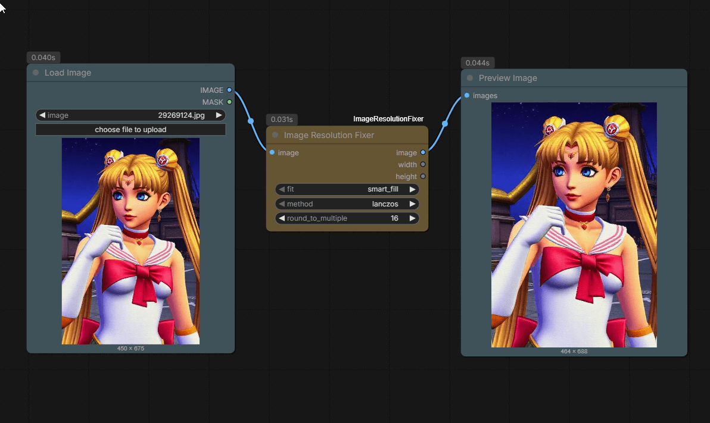

# Image Resolution Fixer - ComfyUI Custom Node

A ComfyUI custom node that fixes image resolutions to be compatible with models that require specific dimension constraints (e.g., divisible by 8, 16, etc.). This node makes **minimal changes** to your images - just rounding up dimensions by a few pixels to the nearest compatible size.



## Dependencies

This node requires:
- `opencv-python` (cv2) - for smart_fill reflection mirroring algorithm

Most ComfyUI installations already have OpenCV installed. If not, install it with:
```bash
pip install opencv-python
```

## Features

- **Minimal Scaling**: Only adjusts dimensions by a few pixels to meet requirements
- **Smart Fill**: Uses reflection mirroring for seamless edge extension (no streaking!)
- **Multiple Fit Modes**: smart_fill, fill, letterbox, or crop
- **Various Resampling Methods**: Lanczos, Bicubic, Hamming, Bilinear, Box, Nearest
- **Round to Multiple**: Ensures dimensions are divisible by 2, 4, 8, 14, 16, 28, 32, 64, 128, 256, or 512
- **Outputs**: Returns resized image plus final width and height values

## How It Works

Instead of aggressively scaling images, this node simply rounds your existing dimensions UP to the nearest compatible multiple:

- **Input**: 450×603 image
- **Round to multiple**: 8
- **Output**: 456×608 image (just +6×5 pixels!)

The smaller the multiple, the fewer pixels added. Perfect for fixing tensor mismatch errors without changing your image composition.

## Installation

1. Navigate to your ComfyUI custom nodes directory:
   ```bash
   cd ComfyUI/custom_nodes/
   ```

2. Create a new directory for this node:
   ```bash
   mkdir ImageResolutionFixer
   cd ImageResolutionFixer
   ```

3. Copy the `image_resolution_fixer.py` file to this directory

4. Restart ComfyUI

## Usage

### Node Inputs

**Required:**
- `image`: Input image from any ComfyUI image source (e.g., "Load Image" node)
- `fit`: How to adjust the image when rounding dimensions
  - `smart_fill`: Uses OpenCV's BORDER_REFLECT_101 to mirror image content at edges (default, recommended)
    - Mirrors texture seamlessly: `[A,B,C]` → `[A,B,C,B,A,B]` instead of stretching `[A,B,C,C,C,C]`
    - Extremely fast (pure memory operation), no artifacts
    - Perfect for small border additions (1-64 pixels)
  - `fill`: Stretch/compress to exact dimensions (minimal distortion for small changes)
  - `letterbox`: Add black bars to reach dimensions (preserves exact aspect ratio)
  - `crop`: Center crop to reach dimensions (may lose edge information)
- `method`: Resampling algorithm for quality
  - `lanczos`: Highest quality (recommended)
  - `bicubic`: Good quality, balanced speed
  - `bilinear`: Fast, lower quality
  - `hamming`: Good for small adjustments
  - `box`: Good for downscaling
  - `nearest`: Fastest, pixelated (not recommended)
- `round_to_multiple`: Round dimensions to be divisible by this value
  - Options: 2, 4, 8, 14, 16, 28, 32, 64, 128, 256, 512
  - Smaller values = minimal changes to your image
  - Common: 8 for most SD models, 64 for SDXL
  - Video models: 14, 16, 28, 32, or 64 depending on model (see table below)

### Node Outputs

1. `image`: Resized image tensor
2. `width`: Final width (INT)
3. `height`: Final height (INT)

## Example Workflows

### Example 1: Fix Odd Dimensions for SD 1.5
**Problem**: Image is 1023x767, Stable Diffusion requires dimensions divisible by 8

**Settings**:
- fit: `fill`
- method: `lanczos`
- round_to_multiple: `8`

**Result**: Image becomes 1024x768 (scaled up by just 1 pixel in each dimension)

### Example 2: Make Image Compatible for SDXL
**Problem**: Image is 450x603, SDXL works best with dimensions divisible by 64

**Settings**:
- fit: `fill`
- method: `lanczos`
- round_to_multiple: `64`

**Result**: Image becomes 448x640 (minimal scaling to nearest compatible size)

### Example 3: Fix Dimensions with Smart Fill (Recommended)
**Problem**: Image is 1920x1081, need dimensions divisible by 8 without black bars or distortion

**Settings**:
- fit: `smart_fill`
- method: `lanczos`
- round_to_multiple: `8`

**Result**: Image becomes 1920x1088 (7 pixels added by mirroring image content - seamless texture continuation!)

## Common Use Cases

### Quick Reference: Video Model Requirements

| Video Model | Round to Multiple | Frame Formula |
|------------|-------------------|---------------|
| Wan 2.1 / 2.2 | `16` or `32` | `(4 * n) + 1` |
| LTX-Video / LTX-2 | `32` | `(8 * n) + 1` |
| Hunyuan Video | `16` or `32` | `(4 * n) + 1` |
| SVD / SVD-XT | `14`, `28`, or `64` | Fixed (14 or 25) |

### For Stable Diffusion Models
- Most SD models require dimensions divisible by 8
- Set `round_to_multiple`: `8`
- Use `lanczos` or `bicubic` for best quality

### For SDXL
- SDXL works best with dimensions divisible by 64
- Set `round_to_multiple`: `64`
- Common sizes: 1024x1024, 1152x896, 1216x832, etc.

### For Video Models
Video models have more stringent requirements than image models due to both Spatial VAE (width/height) and Temporal Compression (frame count) constraints.

**Wan 2.1 & Wan 2.2** (T2V and I2V variants)
- Round to Multiple: `16` (mandatory) or `32` (highly recommended)
- Optimized for: 1280x720, 832x480
- Frame Count: Multiples of `4` or specific counts like 81, 121

**LTX-Video & LTX-2** (Lightricks DiT architecture)
- Round to Multiple: `32` (strict requirement)
- Optimal Sizes: 768x512, 1216x704
- Frame Count: Must follow formula `(8 * n) + 1` (e.g., 65, 97, 129)

**Hunyuan Video 1.0 & 1.5** (3D VAE with space-time compression)
- Round to Multiple: `16` (minimum) or `32` (safest)
- Optimal Sizes: 1280x720 (native), 848x480 (fast)
- Frame Count: Formula `(4 * n) + 1` (e.g., 17, 33, 49, 129)

**SVD / SVD-XT** (Stable Video Diffusion)
- Round to Multiple: `64` (recommended) or `14` (alternative)
- Fixed frame counts: 14 or 25 frames
- Note: `14` and `28` multiples are included specifically for SVD compatibility

**Pro Tip**: If you see tiling artifacts or a grid pattern in your video output, increase `round_to_multiple` to `64` - this is the most universal safe value for modern DiT models.

## Tips

1. **Choosing the Right Multiple**:
   - Use `8` for most Stable Diffusion 1.5/2.1 models
   - Use `64` for SDXL models  
   - Use `32` for many video models
   - Use `2` or `4` for minimal changes when you're not sure

2. **Quality vs Speed**: 
   - Use `lanczos` for highest quality (recommended for small adjustments)
   - Use `bilinear` for faster processing

3. **Choosing Fit Mode**:
   - Use `smart_fill` for best results (recommended) - extends edges naturally
   - Use `fill` when slight stretching is acceptable
   - Use `letterbox` if you need traditional black bars
   - Use `crop` if you prefer cropping over padding

4. **Understanding the Changes**:
   - With multiple=8: Maximum 7 pixels added per dimension
   - With multiple=64: Maximum 63 pixels added per dimension
   - The node always rounds UP, never down

## Troubleshooting

**Issue**: Node not appearing in ComfyUI
- Solution: Make sure the file is in `ComfyUI/custom_nodes/ImageResolutionFixer/`
- Restart ComfyUI completely

**Issue**: Import errors / "No module named 'cv2'"
- Solution: Install OpenCV: `pip install opencv-python`
- Or if using ComfyUI portable: `python_embeded\python.exe -m pip install opencv-python`

**Issue**: Tensor size mismatch still occurring
- Solution: Increase `round_to_multiple` to a higher value (try 64 or 128)

## License

This custom node is provided as-is for use with ComfyUI.

## Credits

Created to solve tensor size mismatch errors in ComfyUI workflows.
